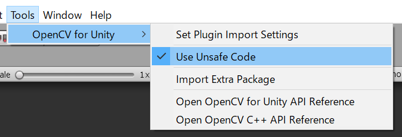

# NatDevice With OpenCVForUnity Example
- An example of a benchmark test integrating NatDevice and OpenCVForUnity. (Comparison between WebCamTexture and NatDevice API)  
- An example of replacing WebCamTextureToMatHelper with NatDeviceCamPreviewToMatHelper.
- An example of native sharing and save to the camera roll using NatShare API.

## Environment
- Anddroid (Pixel 3a) / iOS (iPhoneSE2)
- Unity >= 2020.3.31f1+
- Scripting backend MONO / IL2CPP
- [NatDevice - Media Device API](https://assetstore.unity.com/packages/tools/integration/natdevice-media-device-api-162053?aid=1011l4ehR) 1.2.0+
- [NatShare - Mobile Sharing API](https://github.com/natsuite/NatShare) 1.2.6+
- [OpenCV for Unity](https://assetstore.unity.com/packages/tools/integration/opencv-for-unity-21088?aid=1011l4ehR) 2.4.7+

## Demo
- Android [NatDeviceWithOpenCVForUnityExample.apk](https://github.com/EnoxSoftware/NatDeviceWithOpenCVForUnityExample/releases)

## Setup
1. Download the latest release unitypackage. [NatDeviceWithOpenCVForUnityExample.unitypackage](https://github.com/EnoxSoftware/NatDeviceWithOpenCVForUnityExample/releases)
1. Create a new project. (NatDeviceWithOpenCVForUnityExample)
    * Enable "Allow 'unsafe' Code" option in the "Player Settings > Other Settings" Inspector.
1. Import NatDevice.
1. Import NatShare.
1. Import OpenCVForUnity.
    * Setup the OpenCVForUnity. (Tools > OpenCV for Unity > Set Plugin Import Settings)
    * Select MenuItem[Tools/OpenCV for Unity/Use Unsafe Code]. 
      
      
1. Import the NatDeviceWithOpenCVForUnityExample.unitypackage.
1. Change the "Minimum API Level" to 24 or higher in the "Player Settings (Androd)" Inspector.
1. Change the "Target minimum iOS Version" to 13 or higher in the "Player Settings (iOS)" Inspector.
    * Set the reason for accessing the camera in "cameraUsageDescription".
1. Add the "Assets/NatDeviceWithOpenCVForUnityExample/*.unity" files to the "Scenes In Build" list in the "Build Settings" window.
1. Build and Deploy to Android and iOS.

## Android Instructions
Build requires Android SDK Platform 29 or higher.

## iOS Instructions
After building an Xcode project from Unity, add the following keys to the `Info.plist` file with a good description:
- `NSPhotoLibraryUsageDescription`
- `NSPhotoLibraryAddUsageDescription`

## ScreenShot
 
 
 
